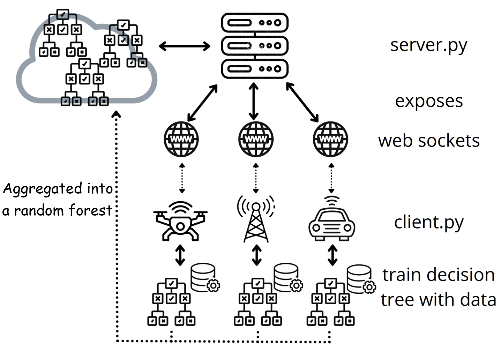

# Federated Learning Intrusion Detection in IoT Devices

This was the course project for IFT6261 for [Riadh](github.com/Riadh-Medtech) and myself.

Federated Learning done using the [flower library](flower.dev)

The notebook contains general analytics and visualizations as well as a baseline non-federated random forest model.

The federated model is contained in `models.py` and can be run on the controller node with `server.py` and on IoT devices with `client.py`

`data_handle.py` handles all of the data loading and preprocessing for the models

`prototype_hard_coded_random_forest.py` is a depreciated file which contains our attempt at hard-coding a decision tree. 

The `data` folder is the initial data which was later replaced by data graciously provided by the CRIM and Syncromedia.

`dataset_[0-3].csv` provides a sample data for a server and 3 clients

## To run (in separate terminals)
```
python3 server.py
python3 client.py 0
python3 client.py 1
python3 client.py 2
```

## Prerequisites
```
pip install -r requirements.txt
```
For development: download data as-is from the drive in a folder named `QRS_dataset`

## Code structure of the federated learning random forest



For the federated decision tree it is identical except that all IoT devices communicate with a single socket.

## Working on
 - [x] code cleaning
 - [x] imports cleaning
 - [x] code commenting
 - [x] code optimizing (for different methods/dataset)
 - [x] implementing a random forest version
 - [x] automating running
 - [x] saving model once done with training
 - [x] make it work with PI